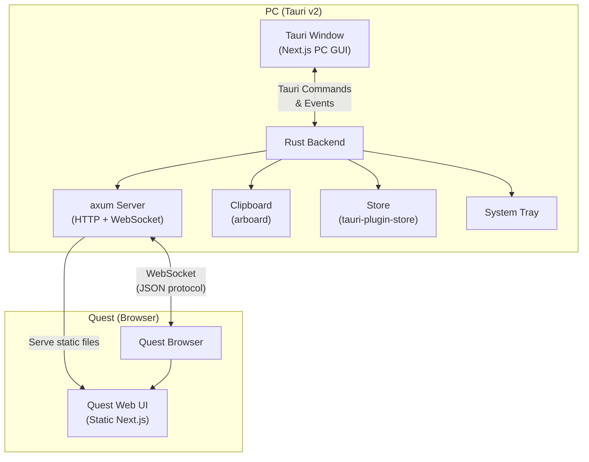
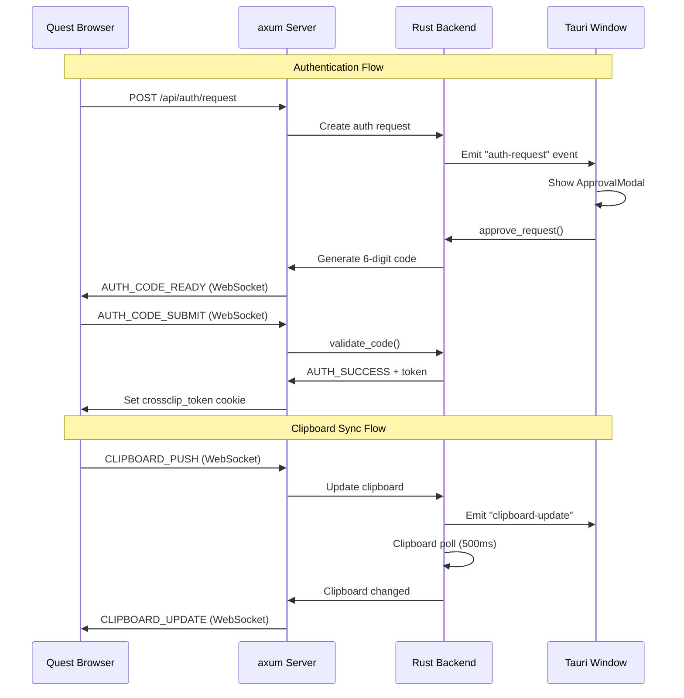

# CrossClip — Cross-Device Clipboard Sharing App

Build a Tauri v2 + Next.js desktop application that enables real-time clipboard sharing between a Meta Quest headset (via its built-in browser) and a PC. The PC runs an embedded HTTP/WebSocket server (axum); the Quest connects via browser.

## User Review Required

> [!IMPORTANT]
> **Tailwind CSS version**: The spec requests Tailwind CSS v3. We'll use v3 as specified. If you prefer v4, let us know.

> [!IMPORTANT]
> **Next.js static export limitation**: Using `output: 'export'` means no API routes, no SSR, no middleware. All server logic lives in Rust/axum. The Quest browser UI will be served as static files by the axum server, with all real-time communication via WebSocket. Auth endpoints (`/api/auth/request`) will be axum routes, not Next.js API routes.

> [!WARNING]
> **Scope**: This is a very large project (~40+ files, Rust + TypeScript). The implementation will be done in phases. Initial delivery will focus on getting a working end-to-end flow, then iterating on polish and edge cases.

## Open Questions

1. **QR code library**: The spec suggests `qrcode` npm package. Since the PC GUI runs in Tauri (which can use npm packages), this works. For the Rust side, we could alternatively generate QR codes server-side using `qrcode` Rust crate. **Plan**: Use the npm `qrcode` package on the frontend.

2. **Clipboard polling on PC**: The Tauri clipboard plugin reads on demand but doesn't provide change events. We'll need to poll the PC clipboard at an interval (e.g., every 500ms) to detect changes and push to Quest. **Is this acceptable, or do you prefer a different approach?**

3. **Icon assets**: The project needs tray icons and app icons. We'll generate placeholder icons initially. **Do you have custom icon assets, or should we create simple ones?**

---

## Proposed Changes

The implementation is organized into 8 phases, ordered by dependency.

---

### Phase 1: Project Scaffolding

Set up the Tauri v2 + Next.js project structure with all dependencies.

#### [NEW] [package.json](file:///c:/project/vr-paste/package.json)
- Next.js 14+, React 18, TypeScript, Tailwind CSS v3
- Dependencies: `zustand`, `qrcode`, `react-hot-toast`, `@tauri-apps/api`, `@tauri-apps/plugin-store`, `@tauri-apps/plugin-clipboard-manager`

#### [NEW] [next.config.js](file:///c:/project/vr-paste/next.config.js)
- `output: 'export'` for Tauri static file loading
- `images: { unoptimized: true }`

#### [NEW] [tsconfig.json](file:///c:/project/vr-paste/tsconfig.json)
- Standard Next.js TypeScript config with path aliases (`@/` → `src/`)

#### [NEW] [tailwind.config.ts](file:///c:/project/vr-paste/tailwind.config.ts)
- Dark theme only, custom color palette using CSS variables
- Custom fonts: JetBrains Mono, Noto Sans JP

#### [NEW] [postcss.config.js](file:///c:/project/vr-paste/postcss.config.js)

#### [MODIFY] [.gitignore](file:///c:/project/vr-paste/.gitignore)
- Add Rust/Tauri entries (`src-tauri/target/`, etc.)

#### [NEW] [src-tauri/Cargo.toml](file:///c:/project/vr-paste/src-tauri/Cargo.toml)
- `tauri = "2"` with `tray-icon` feature
- `tauri-plugin-store = "2"`, `tauri-plugin-clipboard-manager = "2"`
- `axum` with `ws` feature, `tokio`, `tower-http` (CORS)
- `arboard` for direct clipboard access from axum handlers
- `serde`, `serde_json`, `uuid`, `rand`, `chrono`
- `local-ip-address` for network interface detection

#### [NEW] [src-tauri/tauri.conf.json](file:///c:/project/vr-paste/src-tauri/tauri.conf.json)
- Product name "CrossClip", window title, min size 900×600
- Dev URL `http://localhost:3000`, frontend dist `../out`
- Tray icon configuration
- Plugin permissions for store, clipboard-manager

#### [NEW] [src-tauri/capabilities/default.json](file:///c:/project/vr-paste/src-tauri/capabilities/default.json)
- Tauri v2 capability permissions for plugins

#### [NEW] [src-tauri/build.rs](file:///c:/project/vr-paste/src-tauri/build.rs)
- Standard Tauri build script

#### [NEW] [src-tauri/icons/](file:///c:/project/vr-paste/src-tauri/icons/)
- Placeholder app icons (will use Tauri's default icon generation)

---

### Phase 2: Rust Backend — Core Infrastructure

#### [NEW] [src-tauri/src/main.rs](file:///c:/project/vr-paste/src-tauri/src/main.rs)
- Tauri entry point
- Register plugins: store, clipboard-manager
- Setup hook: initialize shared `AppState`, spawn axum server, setup tray
- Window close event handler (minimize to tray when background mode enabled)
- Tauri commands: `get_server_info`, `get_local_ip`, `toggle_server`, `get_settings`, `save_settings`

#### [NEW] [src-tauri/src/state.rs](file:///c:/project/vr-paste/src-tauri/src/state.rs)
- `AppState` struct (shared via `Arc`): server status, port, connected devices, clipboard log, auth sessions, pending auth requests, settings
- Thread-safe with `RwLock`/`Mutex` for concurrent access from Tauri commands and axum handlers

#### [NEW] [src-tauri/src/port.rs](file:///c:/project/vr-paste/src-tauri/src/port.rs)
- `find_available_port()`: random selection in 1024–49151, TCP bind test, retry up to 10 times
- `find_port_in_range(start, end)`: for range mode
- `check_port_available(port)`: for manual mode

#### [NEW] [src-tauri/src/network.rs](file:///c:/project/vr-paste/src-tauri/src/network.rs)
- `get_local_ip()`: detect the primary LAN IP address
- `is_private_ip(ip)`: check against RFC 1918 ranges (10/8, 172.16/12, 192.168/16, 127/8, ::1)
- IP filtering middleware for axum (reject non-private IPs when setting is OFF)

---

### Phase 3: Rust Backend — axum Server & WebSocket

#### [NEW] [src-tauri/src/server.rs](file:///c:/project/vr-paste/src-tauri/src/server.rs)
- `start_server(state, port)`: bind axum to `0.0.0.0:<port>`
- Routes:
  - `GET /` → redirect to `/quest/` (for Quest browser)
  - `GET /quest/*` → serve static files from the Next.js `out/quest/` directory
  - `POST /api/auth/request` → handle connection request
  - `GET /ws` → WebSocket upgrade
- CORS configuration
- IP filtering middleware (checks `is_private_ip` unless external access allowed)
- Rate limiting for auth endpoints (10 req/min per IP)
- Static file serving with proper MIME types
- Cookie handling for `crossclip_token`

#### [NEW] [src-tauri/src/websocket.rs](file:///c:/project/vr-paste/src-tauri/src/websocket.rs)
- WebSocket handler using axum's `extract::ws`
- Message protocol: parse/serialize JSON messages per the spec
- Handle `CLIPBOARD_PUSH`: validate token, update PC clipboard via `arboard`, broadcast `CLIPBOARD_UPDATE`
- Handle `AUTH_CODE_SUBMIT`: validate code, generate token, send `AUTH_SUCCESS`
- Handle `PING`/`PONG` keep-alive (30s interval)
- Token validation on every non-auth message
- Connection tracking (add/remove from `AppState.connected_devices`)
- Connection limit enforcement

#### [NEW] [src-tauri/src/clipboard.rs](file:///c:/project/vr-paste/src-tauri/src/clipboard.rs)
- Clipboard polling loop (runs on a separate task)
- Polls PC clipboard every 500ms via `arboard`
- On change detection, broadcasts `CLIPBOARD_UPDATE` to all connected WebSocket clients
- Maintains clipboard log in `AppState` (capped at configured max entries)

---

### Phase 4: Rust Backend — Authentication & Tray

#### [NEW] [src-tauri/src/auth.rs](file:///c:/project/vr-paste/src-tauri/src/auth.rs)
- `AuthManager`: manages pending requests, approval codes, sessions
- `create_auth_request(ip, ua)` → stores pending request, notifies PC GUI via Tauri event
- `approve_request(request_id)` → generates 6-digit code (CSPRNG via `OsRng`), starts expiry timer
- `reject_request(request_id)` → notifies Quest
- `validate_code(request_id, code)` → check code, track attempts (max 5), 10-min lockout
- `create_session(ip, ua)` → generate UUID v4 token, store in `tauri-plugin-store`
- `validate_session(token)` → check against stored sessions, verify expiry
- `revoke_session(token)` → remove from store
- `revoke_all_sessions()` → clear all
- Session storage schema in `tauri-plugin-store`:
  ```json
  {
    "sessions": {
      "<token>": { "ip": "...", "ua": "...", "created": 1234567890, "expires": 1234567890 }
    }
  }
  ```

#### [NEW] [src-tauri/src/tray.rs](file:///c:/project/vr-paste/src-tauri/src/tray.rs)
- `setup_tray(app)`: create tray icon with menu items:
  - 「ウィンドウを開く」→ show/focus main window
  - 「サーバーを停止」/「サーバーを起動」→ toggle server (dynamic label)
  - 「CrossClipを終了」→ exit app
- Tray icon click → show main window

---

### Phase 5: Next.js Frontend — Foundation & Layout

#### [NEW] [src/app/globals.css](file:///c:/project/vr-paste/src/app/globals.css)
- CSS variables (the dark industrial-minimal palette from spec)
- Font imports (JetBrains Mono, Noto Sans JP via Google Fonts)
- Base styles, scrollbar styling, animation keyframes
- Utility classes for the design system

#### [NEW] [src/app/layout.tsx](file:///c:/project/vr-paste/src/app/layout.tsx)
- Root layout: HTML lang="ja", font loading, Toaster provider
- Conditional rendering: if in Tauri context → PC layout with sidebar; if in browser → Quest layout

#### [NEW] [src/app/page.tsx](file:///c:/project/vr-paste/src/app/page.tsx)
- PC main page (メイン画面)
- Detects Tauri context, shows onboarding on first launch
- Renders: ConnectionStatusPanel, DeviceList, ClipboardPanel, ClipboardLog

#### [NEW] [src/app/settings/page.tsx](file:///c:/project/vr-paste/src/app/settings/page.tsx)
- PC settings page (設定画面)
- All settings sections: サーバー設定, セキュリティ設定, クリップボード設定, デバッグ設定
- Settings are loaded/saved via `tauri-plugin-store`

#### [NEW] [src/app/debug/page.tsx](file:///c:/project/vr-paste/src/app/debug/page.tsx)
- Debug page (デバッグ画面) — terminal aesthetic
- Tabs: 通信ログ, アプリログ, 接続履歴, サーバー状態
- Log export functionality

#### [NEW] [src/app/quest/layout.tsx](file:///c:/project/vr-paste/src/app/quest/layout.tsx)
- Quest-specific layout: full viewport, VR-optimized, animated grid background
- Min font 18px, min tap target 56px

#### [NEW] [src/app/quest/page.tsx](file:///c:/project/vr-paste/src/app/quest/page.tsx)
- Quest auth flow entry page
- Checks for `crossclip_token` cookie → if valid, redirect to `/quest/clipboard`
- If no token → show 接続リクエスト page
- Auth flow states: request → waiting → code entry → success/failure

#### [NEW] [src/app/quest/clipboard/page.tsx](file:///c:/project/vr-paste/src/app/quest/clipboard/page.tsx)
- Quest main clipboard page
- テキスト入力エリア with debounced sync
- 現在のPCクリップボード display
- Connection status badge
- Two-column layout on wide viewports

---

### Phase 6: React Components

#### PC GUI Components

#### [NEW] [src/components/pc/Sidebar.tsx](file:///c:/project/vr-paste/src/components/pc/Sidebar.tsx)
- Fixed left sidebar, collapsible (64px → 220px)
- Navigation: メイン, 設定, デバッグ (conditional)
- Active state indicator, icon + label

#### [NEW] [src/components/pc/ConnectionStatusPanel.tsx](file:///c:/project/vr-paste/src/components/pc/ConnectionStatusPanel.tsx)
- Server running/stopped status with animated dot
- Current IP:PORT display (JetBrains Mono)
- QR code button → opens QRCodeModal

#### [NEW] [src/components/pc/DeviceList.tsx](file:///c:/project/vr-paste/src/components/pc/DeviceList.tsx)
- Connected devices table: IP, nickname, disconnect/revoke buttons
- Empty state message

#### [NEW] [src/components/pc/ClipboardPanel.tsx](file:///c:/project/vr-paste/src/components/pc/ClipboardPanel.tsx)
- Current PC clipboard preview (truncated 300 chars)
- 「全文表示」expand button
- 「コピー」「クリア」 buttons

#### [NEW] [src/components/pc/ClipboardLog.tsx](file:///c:/project/vr-paste/src/components/pc/ClipboardLog.tsx)
- Reverse-chronological scrollable table
- Columns: timestamp, content preview, source badge (PC/Quest), 再コピー button
- Flash highlight animation on new entries
- 「ログをクリア」button

#### [NEW] [src/components/pc/ApprovalModal.tsx](file:///c:/project/vr-paste/src/components/pc/ApprovalModal.tsx)
- Modal overlay (non-dismissable by outside click)
- Shows: IP, UA, 60-second countdown with progress ring
- 「承認する」/「拒否する」buttons
- Transitions to approval code display (6 large digit boxes) on approve
- Code expiry countdown, 「コードを無効にする」button

#### [NEW] [src/components/pc/QRCodeModal.tsx](file:///c:/project/vr-paste/src/components/pc/QRCodeModal.tsx)
- Generates QR code for `http://<IP>:<PORT>/quest`
- SVG rendering via `qrcode` package
- Displays URL text below QR

#### [NEW] [src/components/pc/OnboardingScreen.tsx](file:///c:/project/vr-paste/src/components/pc/OnboardingScreen.tsx)
- First-launch welcome screen
- Shows server URL and QR code
- Instructions for Quest connection

#### Quest Browser Components

#### [NEW] [src/components/quest/AuthRequest.tsx](file:///c:/project/vr-paste/src/components/quest/AuthRequest.tsx)
- Connection request page: IP/port confirmation
- 「PCに接続リクエストを送る」button
- Waiting state with spinner: 「PC側で承認をお待ちください...」
- Rejection state: 「接続が拒否されました」with retry

#### [NEW] [src/components/quest/CodeEntry.tsx](file:///c:/project/vr-paste/src/components/quest/CodeEntry.tsx)
- 6-digit code input (individual boxes, auto-advance)
- 「確認」button (disabled until all filled)
- Error display, attempt counter
- Lockout message after 5 failures

#### [NEW] [src/components/quest/ClipboardInput.tsx](file:///c:/project/vr-paste/src/components/quest/ClipboardInput.tsx)
- Large textarea 「送信するテキスト」
- Debounced WebSocket sync (configurable, default 300ms)
- 「クリア」button

#### [NEW] [src/components/quest/PCClipboardDisplay.tsx](file:///c:/project/vr-paste/src/components/quest/PCClipboardDisplay.tsx)
- Read-only display: 「現在のPCクリップボード」
- Real-time updates via WebSocket
- 「クリップボードにコピー」button (uses `navigator.clipboard.writeText`)

#### [NEW] [src/components/quest/StatusBadge.tsx](file:///c:/project/vr-paste/src/components/quest/StatusBadge.tsx)
- Connection status: 「● 接続中」(cyan) / 「○ 切断」(red)
- Animated pulse on connected state

#### Shared Components

#### [NEW] [src/components/shared/Card.tsx](file:///c:/project/vr-paste/src/components/shared/Card.tsx)
- Reusable card component with `--bg-surface` background, border, border-radius

#### [NEW] [src/components/shared/Button.tsx](file:///c:/project/vr-paste/src/components/shared/Button.tsx)
- Styled button variants: primary (cyan), danger (red), secondary (border)

#### [NEW] [src/components/shared/Modal.tsx](file:///c:/project/vr-paste/src/components/shared/Modal.tsx)
- Modal overlay with animation (200ms scale + fade)
- Configurable: dismissable vs non-dismissable

---

### Phase 7: State Management & Hooks

#### [NEW] [src/store/clipboardStore.ts](file:///c:/project/vr-paste/src/store/clipboardStore.ts)
- Zustand store: `currentText`, `log[]`, actions for add/clear/recopy

#### [NEW] [src/store/connectionStore.ts](file:///c:/project/vr-paste/src/store/connectionStore.ts)
- Zustand store: `connectedDevices[]`, `serverStatus`, `serverPort`, `localIp`, `pendingAuthRequests[]`

#### [NEW] [src/store/settingsStore.ts](file:///c:/project/vr-paste/src/store/settingsStore.ts)
- Zustand store: all settings with load/save actions via `tauri-plugin-store`

#### [NEW] [src/hooks/useWebSocket.ts](file:///c:/project/vr-paste/src/hooks/useWebSocket.ts)
- WebSocket connection hook (used by Quest browser)
- Auto-reconnect with exponential backoff
- Message parsing, event dispatch to Zustand stores
- Ping/pong handling

#### [NEW] [src/hooks/useTauriEvents.ts](file:///c:/project/vr-paste/src/hooks/useTauriEvents.ts)
- Hook for listening to Tauri events from Rust backend (used by PC GUI)
- Events: `auth-request`, `clipboard-update`, `server-status-change`, `device-connected`, `device-disconnected`

#### [NEW] [src/hooks/useClipboard.ts](file:///c:/project/vr-paste/src/hooks/useClipboard.ts)
- PC clipboard read/write via `@tauri-apps/plugin-clipboard-manager`
- Quest clipboard via `navigator.clipboard`

#### [NEW] [src/hooks/useSettings.ts](file:///c:/project/vr-paste/src/hooks/useSettings.ts)
- Settings load/save hook via `@tauri-apps/plugin-store`

#### [NEW] [src/lib/constants.ts](file:///c:/project/vr-paste/src/lib/constants.ts)
- WebSocket message types, default settings values, port range constants

#### [NEW] [src/lib/utils.ts](file:///c:/project/vr-paste/src/lib/utils.ts)
- Utility functions: truncateText, formatTimestamp, cn (classnames helper)

---

### Phase 8: Integration & Polish

#### [MODIFY] [src/app/globals.css](file:///c:/project/vr-paste/src/app/globals.css)
- Final animation keyframes: page transitions, status pulse, log entry flash
- Quest animated grid background
- Scrollbar styling
- Debug terminal aesthetic styles

#### [MODIFY] [README.md](file:///c:/project/vr-paste/README.md)
- Project documentation, setup instructions, architecture overview

---

## Architecture Diagram



## Communication Flow



---

## Verification Plan

### Automated Tests

1. **Rust unit tests**: `cargo test` in `src-tauri/`
   - Port selection logic
   - IP validation (private/public)
   - Auth code generation and validation
   - Session management
   - Rate limiting

2. **Build verification**: 
   - `npm run build` — Next.js static export succeeds
   - `cargo build` — Rust compilation succeeds
   - `npx tauri build` — Full Tauri build succeeds (if needed)

3. **Dev mode launch**: `npx tauri dev` — app window opens, server starts

### Manual Verification

1. **PC GUI**: Launch app, verify all panels render, settings save/load
2. **Quest connection**: Open Quest browser to `http://<PC_IP>:<PORT>/quest/`, complete auth flow, verify clipboard sync
3. **Tray**: Close window → verify tray icon appears, menu items work
4. **Background mode**: Verify server continues when window is hidden
5. **Multi-device limit**: Test connection rejection when limit reached
